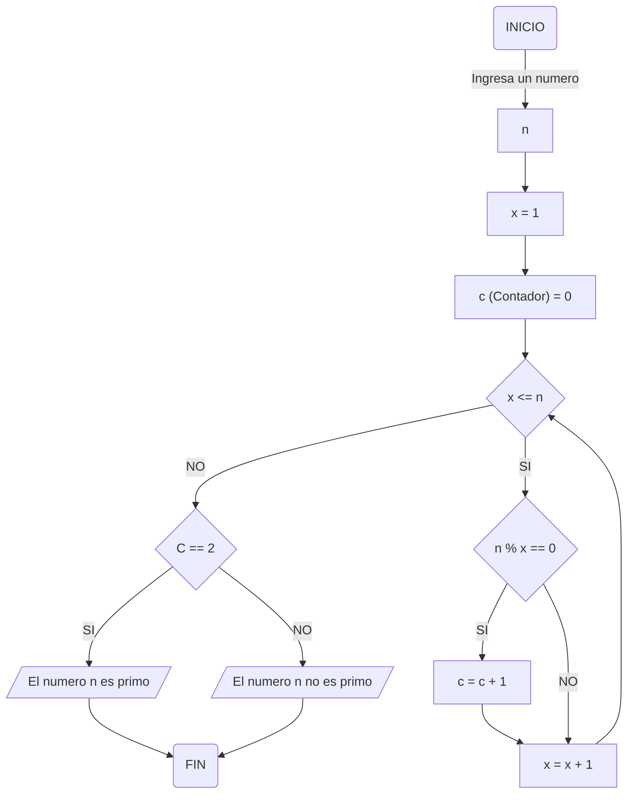
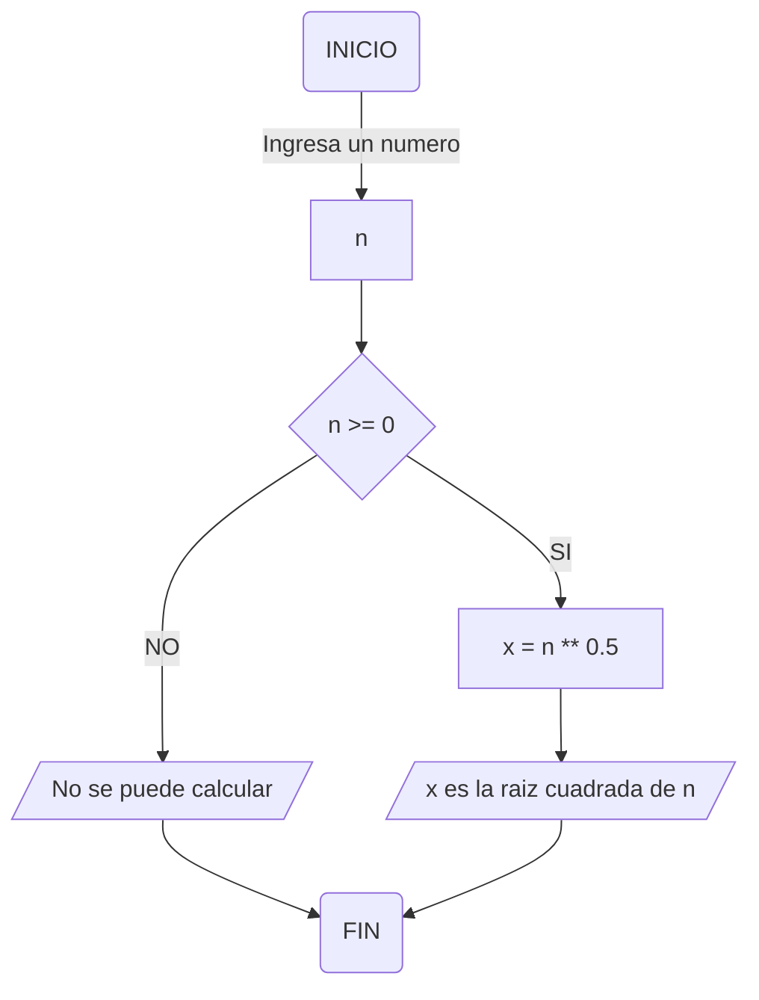

# Reto Clase 3 😲
By Juan Esteban Molina Rey (eljuanessoy)
1. Algoritmo para obtener los números primos

Para el primer caso desarrolle el flujograma para determinar si un numero es o no es primo:

Pseudocodigo:
```pseudocode
Algoritmo Numeros Primos
n seran numeros enteros
X = 1
(c es un contador)
Inicio
ingresar un numero (n)
leer n
c = 0
x = 1
si x <= n hacer
    si n % x == 0 entonces
        c = c + 1 , x = x + 1 y repetir proceso
    sino solamente x = x + 1 y repetir proceso
finsi
si x > n entonces     
    si c == 2 entonces
        El numero n es primo
    finsi    
    sino
        El numero n no es primo
    finno     
FIN
```

2. Algoritmo para obtener la raiz cuadrada de un numero

Para el segundo caso desarrolle el flujograma para calcular la riaz cuadrada de un numero:

Pseudocodigo:
```pseudocode
Algoritmo Raiz Cuadrada
n tomará el valor de cualquier numero real
x = resultado de raiz cuadrada de n
Inicio
ingresar un numero (n)
leer n
    si n >= 0 entonces
        x = n ** 0.5
            escribir "x es la raiz cuadrada de n"
    sino
        escribir "No se puede calcular"
    finsi
    finno
FIN
```
