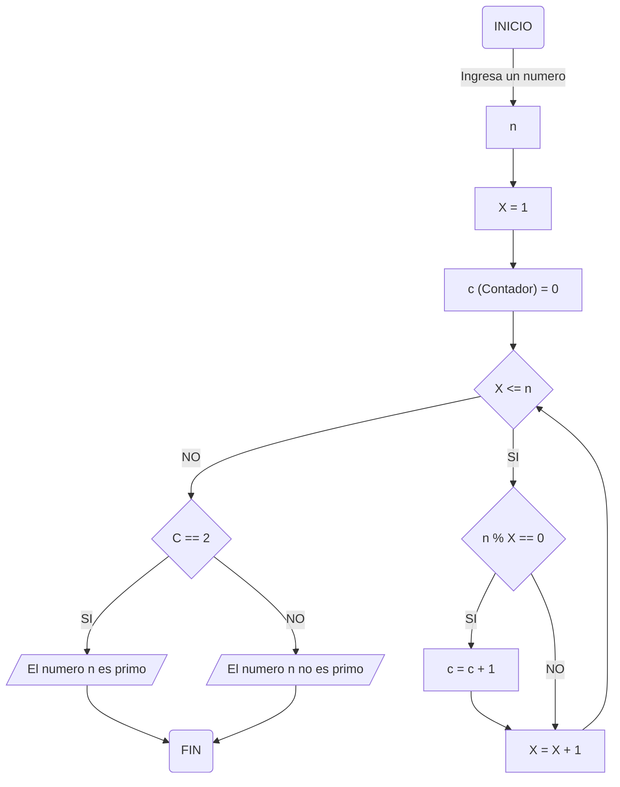

# Reto Clase 3 😲
By Juan Esteban Molina Rey (eljuanessoy)
1. Algoritmo para obtener los números primos

Para el primer caso desarrolle el flujograma para determinar si un numero es o no es primo:

Pseudocodigo:
```pseudocode
Algoritmo Numeros Primos
n seran numeros enteros
X = 1
(c es un contador)
Inicio
ingresar un numero (n)
leer n
c = 0
x = 1

si n mod x == 0 Entonces
c = c + 1
FinSi
Fin Para             
si c == 2 Entonces
Escribir «El numero «,n,» es primo»
SiNo
Escribir «El numero «,n,» no es primo»
FinSi     
FinAlgoritmo
```
